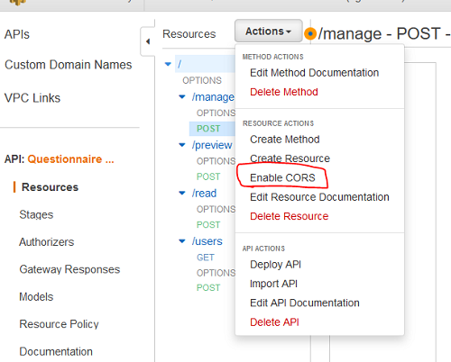

# Setting up a cms and admin stack for development

All Development that would interfere with other people's work should be done in a personal development environment.

## Prerequisites

1. Node and npm package manager installed
1. Node Version Manager (NVM) installed [[guide]](https://github.com/nvm-sh/nvm#installing-and-updating)
1. AWS cdk cli installed [[AWS docs]](https://docs.aws.amazon.com/cli/latest/userguide/getting-started-install.html)
1. AWS cdk cli configured and credentials set [[instructions]](../md/aws-credentials.md)

## Deploying cms and admin stacks

To deploy a custom cms instance one should deploy these projects:

- Webiny Headless CMS with GraphQL api
- admin-infrastructure, stable resources of the admin stack
- admin-backend, apis and other more versatile resources of the admin stack
- admin-frontend, admin application

Whenever there's `[environment name]` in the instructions it should be replaced with custom environment's short name such as developers initials.

### Setting up Webiny Headless CMS

Install webiny according to their instructions: https://www.webiny.com/docs/get-started/install-webiny. Set up Headless CMS and create API Key with full access for headless CMS. Api key is stored in AWS Secrets Manager, for more information see: ../../admin-backend/README.md

### Setting up admin-infra

1. Run `git clone [link removed]`
1. Install dependencies running `npm i` in the project folder
1. Run `./scripts/deploy-stack -e [environment name]` to deploy to the given environment

### Setting up admin-backend

1. Run `git clone [link removed]`
1. Install dependencies running `npm i` in the project folder
1. Run `./scripts/deploy-stack -e [environment name]` to deploy to the given environment
1. Navigate to the list of available apis in the `[link removed]` and look for the api that was deployed in the previous step. The full name of the api is `Questionnaire Admin API - [environment name]`. Open the api's page.
1. Enable CORS for the api endpoints

   

1. Deploy the api (Actions -> Deploy API), selecting the `[environment name]` stage from the dropdown menu. This might take few seconds to take effect.

### Setting up admin-frontend

1. Run `git clone [link removed]`
1. Set up the admin-frontend project following `[link removed]` instructions
1. Run `./scripts/deploy-stack -e [environment name]` to deploy to the given environment
1. Navigate to `[link removed]` to verify that everything is working ok

### Generating data

1. Follow ../../admin-backend/scripts/webiny/README.md instructions to import content models to your new environment.

1. Generate an admin user using the `admin-infrastructure/scripts/add-user.sh` script (`[link removed]`).

   HINT: Cognito user pool used by the admin app is named `mmkadminuserpool[environment name][hash]`.

   HINT: The correct game id can be found from the Webiny app (Headless CMS -> Questionnaires -> [questionnaire name] -> game_uuid) `[link removed]`

